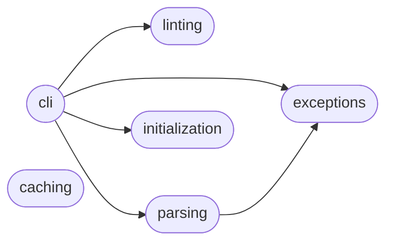

# Code Overview

[_Documentation generated by Documatic_](https://www.documatic.com)

<!---Documatic-section-Codebase Structure Python-start--->
## Codebase Structure Python

The codebase has a flat structure, with 7 code files.

<!---Documatic-block-system_architecture-start--->

<!---Documatic-block-system_architecture-end--->

# #
<!---Documatic-section-Codebase Structure Python-end--->

<!---Documatic-section-Important Functions-start--->
## Important Functions

<!---Documatic-block-important_funcs-start--->
<!---Documatic-block-most_used_funcs-start--->
### Most Utilised Functions

* [bellybutton.linting.lint_file](4-bellybutton_linting.md#bellybutton.linting.lint_file) (1 times)
* [bellybutton.parsing.load_config](3-bellybutton_parsing.md#bellybutton.parsing.load_config) (1 times)
* [bellybutton.initialization.generate_config](5-bellybutton_initialization.md#bellybutton.initialization.generate_config) (1 times)
<!---Documatic-block-most_used_funcs-end--->
<!---Documatic-block-important_funcs-end--->

# #
<!---Documatic-section-Important Functions-end--->

<!---Documatic-section-File IO-start--->
## File IO

<!---Documatic-block-file_io-start--->
The following files have file read operations

<!---Documatic-block-bellybutton-start--->

	
<code>bellybutton</code> (Click to Expand!)

* bellybutton.cli

<!---Documatic-block-bellybutton-end--->

The following files have file write operations

<!---Documatic-block-bellybutton-start--->

	
<code>bellybutton</code> (Click to Expand!)

* bellybutton.cli

<!---Documatic-block-bellybutton-end--->
<!---Documatic-block-file_io-end--->

# #
<!---Documatic-section-File IO-end--->

<!---Documatic-section-Class Hierarchy-start--->
## Class Hierarchy

<!---Documatic-block-YAMLError-start--->

	
<code>YAMLError</code> (Click to Expand!)

* bellybutton.exceptions.InvalidNode

<!---Documatic-block-YAMLError-end--->

# #
<!---Documatic-section-Class Hierarchy-end--->

[_Documentation generated by Documatic_](https://www.documatic.com)