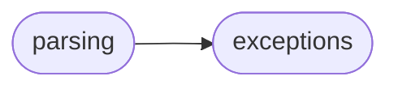
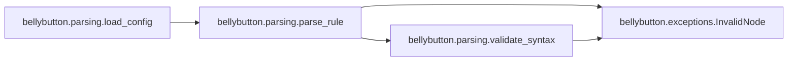
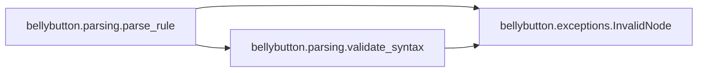

# Bellybutton Parsing

[_Documentation generated by Documatic_](https://www.documatic.com)

<!---Documatic-section-Codebase Structure-start--->
## Codebase Structure

<!---Documatic-block-system_architecture-start--->

<!---Documatic-block-system_architecture-end--->

# #
<!---Documatic-section-Codebase Structure-end--->

<!---Documatic-section-bellybutton.parsing.load_config-start--->
## [bellybutton.parsing.load_config](3-bellybutton_parsing.md#bellybutton.parsing.load_config)

<!---Documatic-section-load_config-start--->


### Object Calls

* [bellybutton.parsing.parse_rule](3-bellybutton_parsing.md#bellybutton.parsing.parse_rule)

<!---Documatic-block-bellybutton.parsing.load_config-start--->
<details>
	<summary><code>bellybutton.parsing.load_config</code> code snippet</summary>

```python
def load_config(fileobj):
    loaded = yaml.load(fileobj, Loader=yaml.FullLoader)
    default_settings = loaded.get('default_settings')
    rules = [parse_rule(rule_name, rule_values, default_settings) for (rule_name, rule_values) in loaded.get('rules', {}).items()]
    return rules
```
</details>
<!---Documatic-block-bellybutton.parsing.load_config-end--->
<!---Documatic-section-load_config-end--->

# #
<!---Documatic-section-bellybutton.parsing.load_config-end--->

<!---Documatic-section-bellybutton.parsing.parse_rule-start--->
## [bellybutton.parsing.parse_rule](3-bellybutton_parsing.md#bellybutton.parsing.parse_rule)

<!---Documatic-section-parse_rule-start--->


### Object Calls

* bellybutton.exceptions.InvalidNode
* bellybutton.parsing.validate_syntax

<!---Documatic-block-bellybutton.parsing.parse_rule-start--->
<details>
	<summary><code>bellybutton.parsing.parse_rule</code> code snippet</summary>

```python
@_reraise_with_rule_name
def parse_rule(rule_name, rule_values, default_settings=None):
    rule_description = rule_values.get('description')
    if rule_description is None:
        raise InvalidNode('No description provided.')
    rule_expr = rule_values.get('expr')
    if rule_expr is None:
        raise InvalidNode('No expression provided.'.format(rule_name))
    matches = lambda x: find_in_ast(file_contents_to_xml_ast(x), rule_expr.path, return_lines=False) if isinstance(rule_expr, XPath) else x.match
    rule_example = rule_values.get('example')
    if rule_example is not None:
        validate_syntax(rule_example, clause_type='example')
        if not matches(rule_example):
            raise InvalidNode('`example` clause is not matched by expression.')
    rule_instead = rule_values.get('instead')
    if rule_instead is not None:
        validate_syntax(rule_instead, clause_type='instead')
        if matches(rule_instead):
            raise InvalidNode('`instead` clause is matched by expression.')
    rule_settings = rule_values.get('settings', default_settings)
    if rule_settings is None:
        raise InvalidNode('No settings or default settings specified.')
    if not isinstance(rule_settings, Settings):
        raise InvalidNode('Settings must be a !settings node.')
    return Rule(name=rule_name, description=rule_description, expr=rule_expr, example=rule_example, instead=rule_instead, settings=rule_settings)
```
</details>
<!---Documatic-block-bellybutton.parsing.parse_rule-end--->
<!---Documatic-section-parse_rule-end--->

# #
<!---Documatic-section-bellybutton.parsing.parse_rule-end--->

[_Documentation generated by Documatic_](https://www.documatic.com)