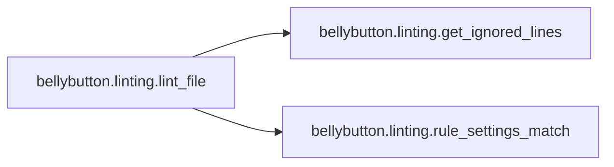

# Bellybutton Linting

[_Documentation generated by Documatic_](https://www.documatic.com)

<!---Documatic-section-Codebase Structure-start--->
## Codebase Structure

<!---Documatic-block-system_architecture-start--->
```mermaid
None
```
<!---Documatic-block-system_architecture-end--->

# #
<!---Documatic-section-Codebase Structure-end--->

<!---Documatic-section-bellybutton.linting.lint_file-start--->
## [bellybutton.linting.lint_file](4-bellybutton_linting.md#bellybutton.linting.lint_file)

<!---Documatic-section-lint_file-start--->


### Object Calls

* [bellybutton.linting.get_ignored_lines](4-bellybutton_linting.md#bellybutton.linting.get_ignored_lines)
* [bellybutton.linting.rule_settings_match](4-bellybutton_linting.md#bellybutton.linting.rule_settings_match)

<!---Documatic-block-bellybutton.linting.lint_file-start--->
<details>
	<summary><code>bellybutton.linting.lint_file</code> code snippet</summary>

```python
def lint_file(filepath, file_contents, rules):
    matching_rules = [rule for rule in rules if rule_settings_match(rule, filepath)]
    if not matching_rules:
        return
    ignored_lines = get_ignored_lines(file_contents)
    xml_ast = file_contents_to_xml_ast(file_contents)
    for rule in sorted(matching_rules, key=attrgetter('name')):
        if isinstance(rule.expr, XPath):
            matching_lines = set(find_in_ast(xml_ast, rule.expr.path, return_lines=True))
        elif isinstance(rule.expr, pattern_type):
            matching_lines = {file_contents[:match.start()].count('\n') + 1 for match in re.finditer(rule.expr, file_contents)}
        elif callable(rule.expr):
            matching_lines = set(rule.expr(file_contents))
        else:
            continue
        if rule.settings.allow_ignore:
            matching_lines -= ignored_lines
        if not matching_lines:
            yield LintingResult(rule, filepath, succeeded=True, lineno=None)
        for line in matching_lines:
            yield LintingResult(rule, filepath, succeeded=False, lineno=line)
```
</details>
<!---Documatic-block-bellybutton.linting.lint_file-end--->
<!---Documatic-section-lint_file-end--->

# #
<!---Documatic-section-bellybutton.linting.lint_file-end--->

<!---Documatic-section-bellybutton.linting.get_ignored_lines-start--->
## [bellybutton.linting.get_ignored_lines](4-bellybutton_linting.md#bellybutton.linting.get_ignored_lines)

<!---Documatic-section-get_ignored_lines-start--->
<!---Documatic-block-bellybutton.linting.get_ignored_lines-start--->
<details>
	<summary><code>bellybutton.linting.get_ignored_lines</code> code snippet</summary>

```python
def get_ignored_lines(file_contents):
    it = iter(file_contents.splitlines(True))
    tokens = tokenize.generate_tokens(lambda : next(it))
    return frozenset((line for (token_type, token, (line, _), _, _) in tokens if token_type is tokenize.COMMENT if re.search('bb:\\s?ignore', token)))
```
</details>
<!---Documatic-block-bellybutton.linting.get_ignored_lines-end--->
<!---Documatic-section-get_ignored_lines-end--->

# #
<!---Documatic-section-bellybutton.linting.get_ignored_lines-end--->

<!---Documatic-section-bellybutton.linting.rule_settings_match-start--->
## [bellybutton.linting.rule_settings_match](4-bellybutton_linting.md#bellybutton.linting.rule_settings_match)

<!---Documatic-section-rule_settings_match-start--->
<!---Documatic-block-bellybutton.linting.rule_settings_match-start--->
<details>
	<summary><code>bellybutton.linting.rule_settings_match</code> code snippet</summary>

```python
def rule_settings_match(rule, filepath):
    should_be_included = any((fnmatch.fnmatch(filepath, included_pattern) for included_pattern in rule.settings.included))
    should_be_excluded = any((fnmatch.fnmatch(filepath, excluded_pattern) for excluded_pattern in rule.settings.excluded))
    return should_be_included and (not should_be_excluded)
```
</details>
<!---Documatic-block-bellybutton.linting.rule_settings_match-end--->
<!---Documatic-section-rule_settings_match-end--->

# #
<!---Documatic-section-bellybutton.linting.rule_settings_match-end--->

[_Documentation generated by Documatic_](https://www.documatic.com)